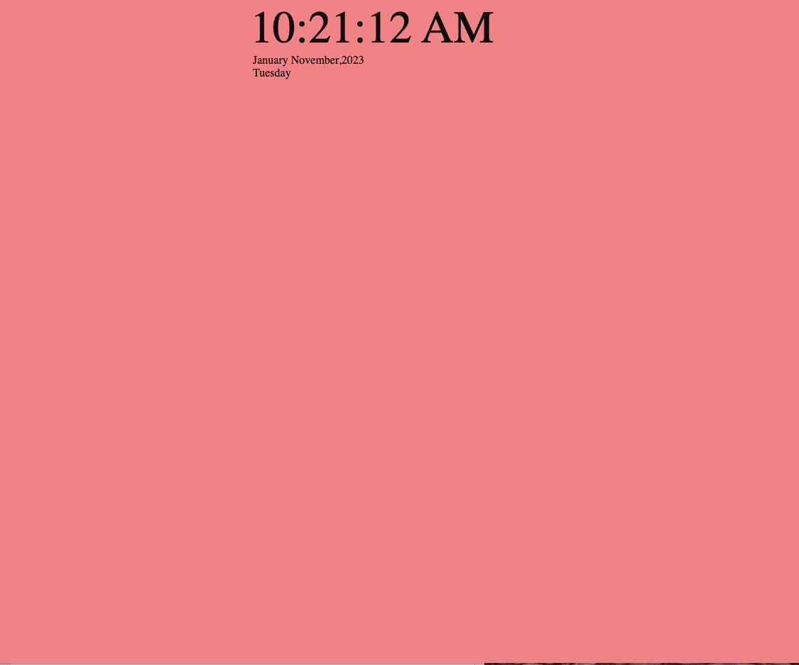

# JS-Clock
A beginner follow along Javascript project building a clock using ONLY HTML files. 

## Follow Along Thoughts
This was my first follow along video, which is why I decided to go with something more basic. I have realized over time, even the smallest code, can be done differently. 

Folowing along in this projext really cleared how I look at the code. Instead of using a separate JS & CSS file, everything was written inside the HTML file. Different from class, it was a great way for me to learn different ways of approaching a project. 

### Follow Along Credits
I followed along with Clint Briley , who owns the youtube channel CodeCommerce.

I really enjoy folllowing along to Clint. His pace and his explanations are clearly stated & make it easy to follow along. 

https://www.youtube.com/watch?v=Ztl4ykKha4o

### Screenshot of Project
